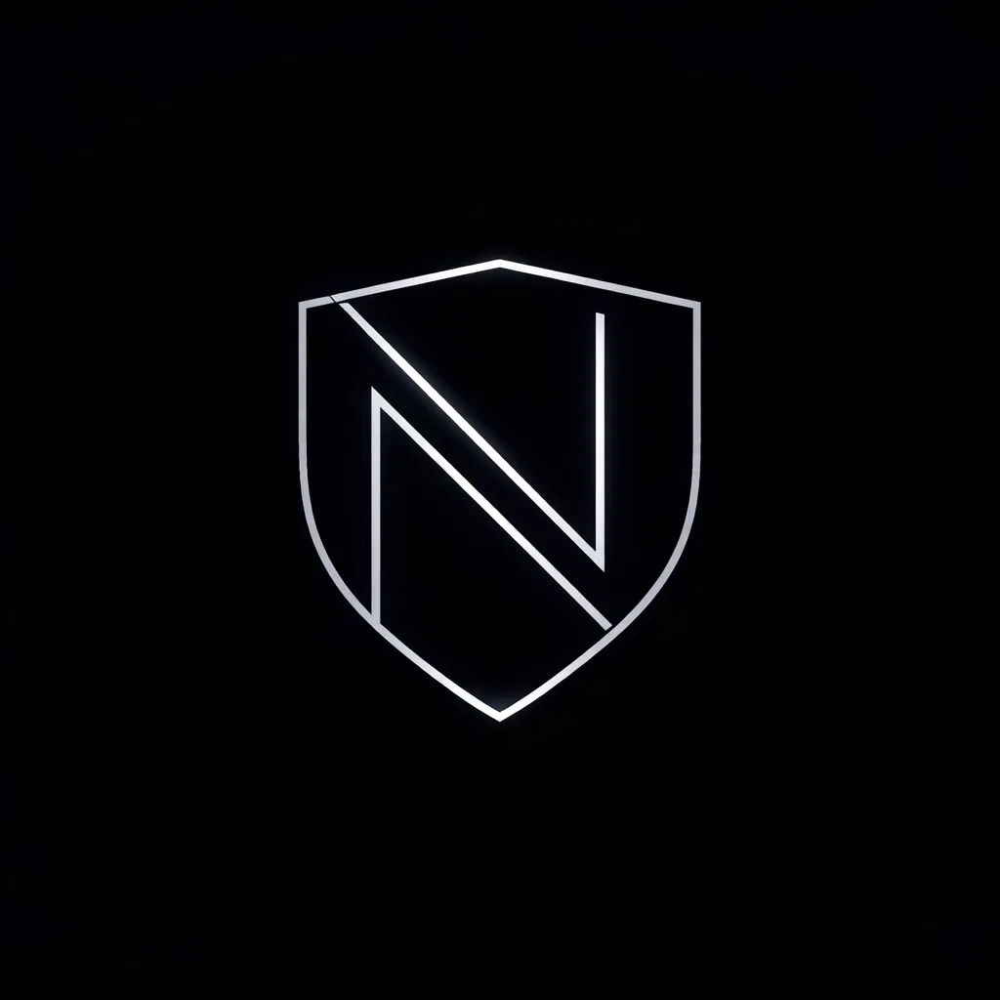

<p align="center">
  
</p>

<h1 align="center">Nulla</h1>

<p align="center">
  <strong>Detect once. Defend across chains.</strong>
</p>

<hr />

<p align="center">
  <a href="./docs/from-zero-to-dual-chain-demo.en.md">
    
  </a>
  <a href="./docs/from-zero-to-dual-chain-demo.md">
    
  </a>
</p>

<p align="center">
  
  
  
  
  
</p>

<p>
  Nulla is a cross-chain Safe protection workflow, not just a generic "firewall" label. You first arm a Safe with Guardian Mode, then Nulla watches approval risk across two chains, reacts on Lasna, revokes the risky approval on the source chain, and immediately hardens the peer chain with Shield Mode.
</p>

<p>
  <strong>Quick Links</strong>
</p>

- 🚀 [English Demo Guide](./docs/from-zero-to-dual-chain-demo.en.md)
- 🇨🇳 [中文双链测试流程](./docs/from-zero-to-dual-chain-demo.md)
- 🎯 [Hackathon Final Submission](./deployments/hackathon-final-submit.md)
- 📽️ [Demo Video](https://www.youtube.com/watch?v=YxFQ8aBQri0)
- 🖥️ [Demo Slides](https://docs.google.com/presentation/d/1-o0GCHv06zMuO-JwtUTMWuHzLi8oaIuM/edit?usp=drive_link&ouid=113133240101784315644&rtpof=true&sd=true)

## Table of Contents

- [⚙️ What Nulla Does](#what-nulla-does)
- [🧩 Extensibility](#extensibility)
- [🚨 Why Nulla](#why-nulla)
- [🧱 Stack](#stack)
- [🔄 Core Demo Flow](#core-demo-flow)
- [📚 Guides](#guides)
- [🛠 Local Commands](#local-commands)

## What Nulla Does

Nulla protects the same Safe across Ethereum Sepolia and Base Sepolia with one shared workflow:

1. **Arm the Safe with Guardian Mode**
   - The owner enables the Safe module and guard on both chains.
   - This turns one Safe into a cross-chain security control room.
2. **Detect a risky approval**
   - If the Safe approves a blacklisted or over-limit spender on either chain, that approval becomes a security event.
3. **React on Lasna**
   - A single Reactive contract on Lasna receives the signal and evaluates the policy.
4. **Contain the incident across both chains**
   - On the source chain, Nulla revokes the risky approval back to `0`.
   - On the peer chain, Nulla pushes the Safe into `Shield Mode`.
5. **Recover safely**
   - Shield can be cleared manually by the operator.
   - Or it can expire automatically after the recovery window.

This means one approval incident on one chain immediately changes the security posture of the other chain too.

## Extensibility

The current demo focuses on ERC-20 approval risk, but the architecture is broader than one hardcoded rule:

- policies can be updated through the subscription and control layer
- spender rules can be allowlisted, blacklisted, or capped
- the Reactive layer can coordinate more than one callback action
- the same pattern can be extended to more tokens, more chains, and richer risk signals
- Safe remains the local execution layer, while Reactive remains the cross-chain coordination layer

## Why Nulla

- Dangerous approvals are everywhere in Web3.
- Granting approvals is easy; cleaning them up is usually manual.
- Same-address multi-chain Safe deployments increase shared blast radius.
- Nulla turns that problem into a single cross-chain security workflow:
  detect risk, revoke locally, shield the peer chain, then recover.

## Stack

- Solidity + Foundry for contracts and scripts
- Reactive Network on Lasna for cross-chain event handling
- Safe modules and guards for approval enforcement
- Next.js for the demo UI, onboarding flow, and control console

## Core Demo Flow

1. Enable Guardian Mode for the shared Safe.
2. Trigger a risky approval on one chain.
3. Let Lasna react and coordinate cross-chain protection.
4. Revoke the source-chain approval.
5. Enter Shield Mode on the peer chain.
6. Exit Shield manually or automatically after the recovery window.


## Guides

- [English end-to-end demo guide](./docs/from-zero-to-dual-chain-demo.en.md)
- [中文双链测试流程](./docs/from-zero-to-dual-chain-demo.md)

## Local Commands

```bash
forge build
forge test -vvv
cd web && npm run typecheck
cd web && npm run build
```
